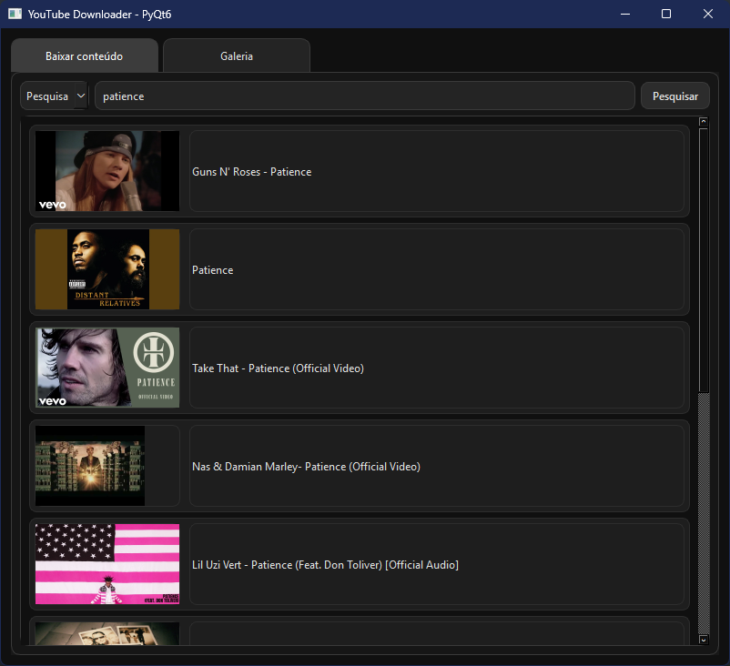
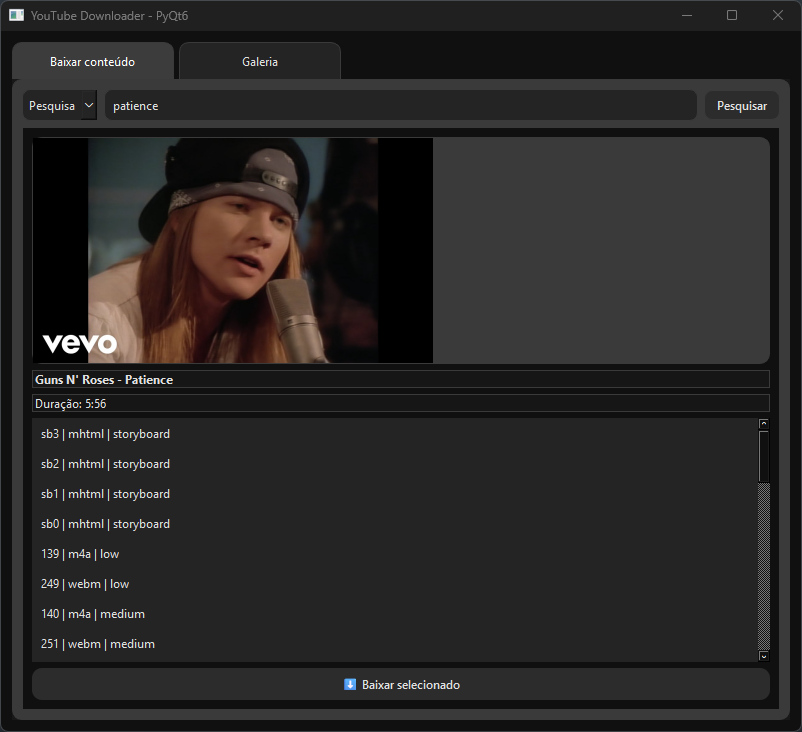

<p align="center">
    
</p>

<h1 align="center">Python YouTube Downloader</h1>

<p align="center">
Um aplicativo moderno feito em <strong>Python</strong> com <strong>PyQt6</strong> para baixar vídeos do YouTube de forma rápida e organizada.
</p>

---

## 🖼 Demonstração

### ✅ Tela principal - Downloader


### ✅ Resultados da pesquisa


---

## 💻 Funcionalidades

- Pesquisa de vídeos diretamente pelo nome ou URL.
- Visualização de thumbnails e informações do vídeo.
- Escolha de formatos disponíveis para download.
- Galeria integrada para gerenciar os vídeos baixados.
- Interface escura elegante, inspirada em aplicativos modernos.

---

## ⚡ Tecnologias Utilizadas

- Python 3.14
- PyQt6
- yt-dlp
- Requests
- Pillow (PIL)  

---

## 🚀 Como Usar

1. Clone este repositório:
- ```git clone https://github.com/Fr4ncisTaylor/YoutubeDownloader```
- ```cd YoutubeDownloader```
- ```pip install -r requiriments.txt```
- ```python main.py```
